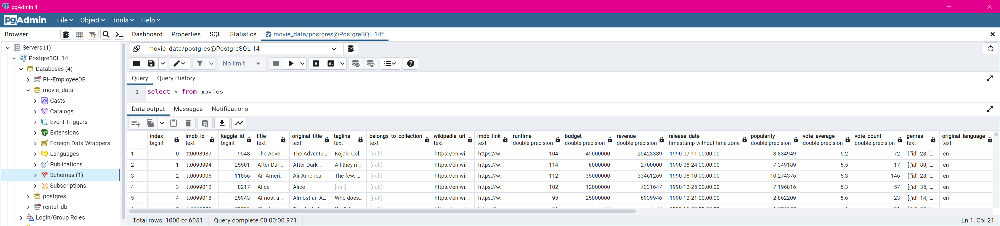
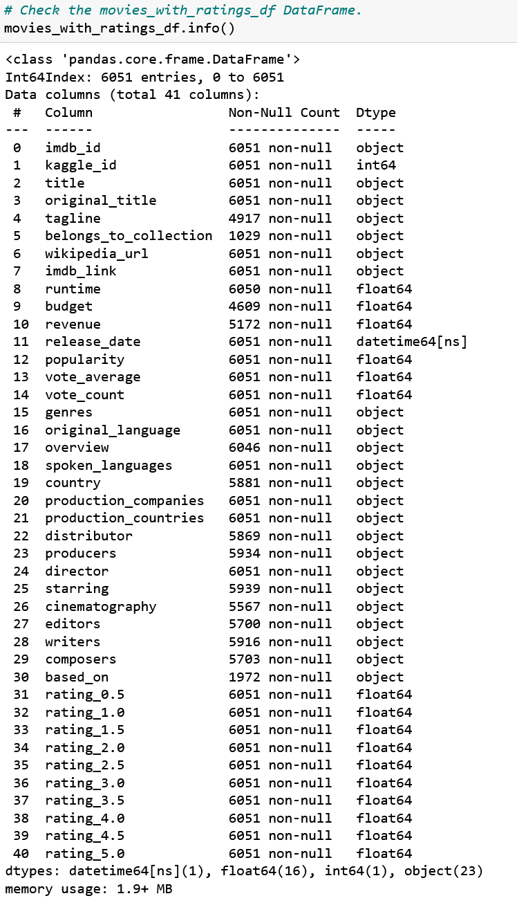
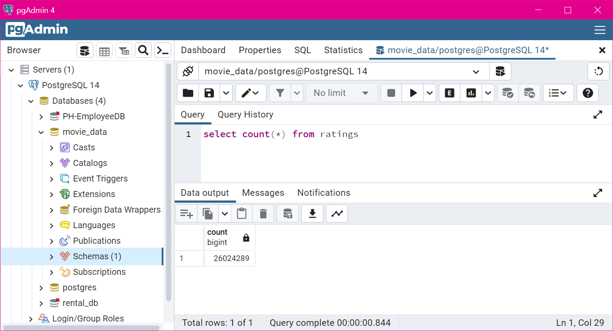
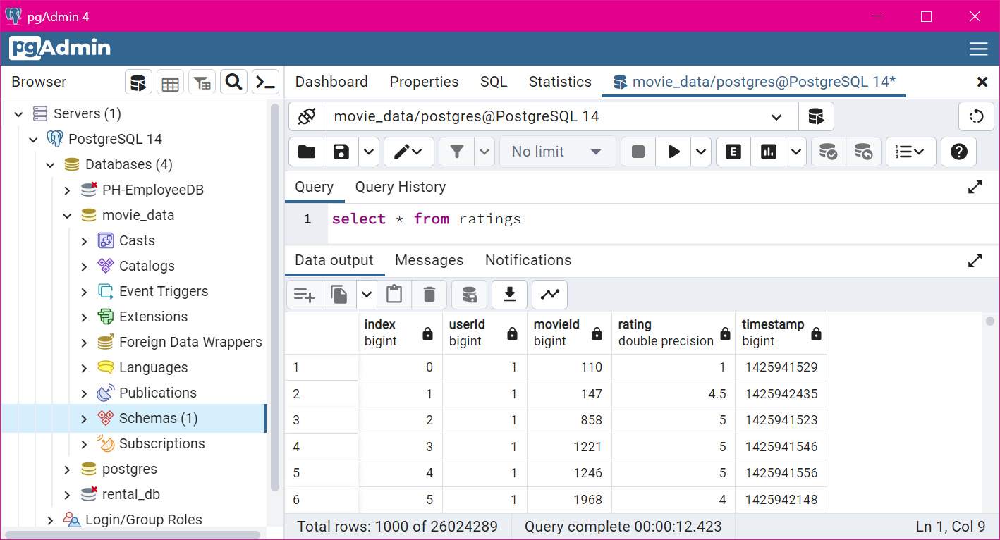

# Movie Data - Extract - Transform - Load (ETL)

### Overview
This project consisted of the incremental development of an ETL pipeline for movie data from three different sources.  The data was imported into a Jupyter notebook, reviewed and transformed, and loaded into a Postgresql database.  The Postgresql database would be available for researchers.

The final Jupyter notebook includes multiple functions that automate the operations and allow the data within the database to be updated at-will.

## Input files

*  wikipedia_movies.json - This data from Wikipedia contains information on movie releases spanning approximately 30 years.
*	movies_metadata.csv - This file contains metadata from The Movie Database (TMDb) - from Kaggle.
*	ratings.csv - This file contains ratings data from MovieLens, collected by the GroupLens research team - containing more than 20 million ratings.

## Extract

### Wikipedia JSON Data
The Wikipedia json data was read into a Jupyter notebook and required significant processing to ensure the format and data content was useable. 
### Kaggle Metadata
The Kaggle data was already in a flat-file CSV format, so it was easily read directly into a Pandas DataFrame.	

### Kaggle (MovieLens) Rating Data
The MovieLens rating data was also in a flat-file CSV format, so it too was read directly into a Pandas DataFrame.

## Transform
### Wikipedia Data

The data columns were sanitized throught the use of a function - clean_movie.

The function collected all alternate title data into a single column, and merged data from similarly-named columns into a single column.  These operations dramatically reduced the number of data columns - from 139 to 39.

	```
	# Create a clean movie function that takes in the argument, "movie".
	def clean_movie(movie):
		movie = dict(movie) # non-destructive copy of the movie-data
		
		alt_titles = {}
		alt_title_fields = ['Also known as','Arabic', 'Cantonese', 'Chinese', 'French', 'Hangul', 'Hebrew', 'Hepburn', 'Japanese', 'Literally',
		'Mandarin', 'McCune–Reischauer', 'Original title', 'Polish', 'Revised Romanization', 'Romanized', 'Russian',
		'Simplified', 'Traditional', 'Yiddish']
		
		# Consolidate any/all alternate titles into a single column
		for a_t in alt_title_fields:
			if a_t in movie:
				alt_titles[a_t] = movie.pop(a_t)
				
			if len(alt_titles) > 0:
				movie['alt_titles'] = alt_titles
				
		# Consolidate column names with a function
		def change_column_name(old_name, new_name):
			if old_name in movie:
				movie[new_name] = movie.pop(old_name)
		
		# Define list of column name transformations
		change_column_name('Adaptation by', 'Writer(s)')
		change_column_name('Original release', 'Release date')
		change_column_name('Music by', 'Composer(s)')
		change_column_name('Story by', 'Writer(s)')
		change_column_name('Screenplay by', 'Writer(s)')
		change_column_name('Written by', 'Writer(s)')
		change_column_name('Theme music composer', 'Composer(s)')
		change_column_name('Country of origin', 'Country')
		change_column_name('Directed by', 'Director')
		change_column_name('Edited by', 'Editor(s)')
		change_column_name('Distributed by', 'Distributor')
		change_column_name('Produced by', 'Producer(s)')
		change_column_name('Producer', 'Producer(s)')
		change_column_name('Original language(s)', 'Language')
		change_column_name('Productioncompanies ', 'Production company(s)')
		change_column_name('Productioncompany ', 'Production company(s)')
		change_column_name('Screen story by', 'Screenplay by')
		change_column_name('Length', 'Running time')
		change_column_name('Released', 'Release date')
		
		return(movie)
	```
Once the number of columns were reduced, the data was read into a Pandas DataFrame.  From here, several regex expressions weree used to ensure the data was in a useable format for the subsequent operations with the Kaggle data.

### Kaggle Metadata
The Kaggle Metadata DataFrame required a small collection of corrections to the data types of the columns to ensure subesquent processing would proceed smoothly.


### Kaggle (MovieLens) Ratings
The Kaggle rating data included a large volume of records - 26,024,289 rows.  This data was transformed by converting the timestaps from Unix epoch to datetime format.  Additionally the DataFrame was pivoted to reduce the volume and allow summarized ratings to be merged with the movie data.

### Merged Wikipedia and Kaggle Metadata
The Wikipedia and Kaggle DataFrames were merged to ensure the most complete data would be available for researchers to analyze.  

	```
	# Merge the wiki_movie and kaggle DataFrames into a consolidated movies DataFrame.
    movies_df = pd.merge(wiki_movies_df, kaggle_metadata_df, on='imdb_id', suffixes=['_wiki','_kaggle'])
	```

To reach this objective, the data in several of the columns was examined to allow choosing which data source would be the best starting data collection. A function ```fill_missing_kaggle_data``` was used to move Wikipedia data into Kaggle colunmns before dropping the unnecessary Wikipedia data columnns.

	```
	# Drop the outliers
    movies_df = movies_df.drop(movies_df[(movies_df['release_date_wiki'] > '1996-01-01') & (movies_df['release_date_kaggle'] < '1965-01-01')].index)
    
    # Drop unnecessary columns from the merged DataFrame.
    movies_df.drop(columns=['title_wiki','release_date_wiki','Language','Production company(s)'], inplace=True)

    # Add a function to fill in the missing Kaggle data.
    def fill_missing_kaggle_data(df, kaggle_column, wiki_column):
        df[kaggle_column] = df.apply(lambda row: row[wiki_column] if row[kaggle_column] == 0 else row[kaggle_column], axis=1)
        df.drop(columns=wiki_column, inplace=True)

    # Use the function to leverage wiki data for Kaggle zero values.
    fill_missing_kaggle_data(movies_df, 'runtime', 'running_time')
    fill_missing_kaggle_data(movies_df, 'budget_kaggle', 'budget_wiki')
    fill_missing_kaggle_data(movies_df, 'revenue', 'box_office')

    # Filter the movies DataFrame for specific columns.
    movies_df = movies_df.loc[:, ['imdb_id','id','title_kaggle','original_title','tagline','belongs_to_collection','url',
                                  'imdb_link','runtime','budget_kaggle','revenue','release_date_kaggle','popularity',
                                  'vote_average','vote_count','genres','original_language','overview','spoken_languages',
                                  'Country','production_companies','production_countries','Distributor','Producer(s)',
                                  'Director','Starring','Cinematography','Editor(s)','Writer(s)','Composer(s)','Based on']]

    # Rename the columns in the movies DataFrame.
    movies_df.rename({'id':'kaggle_id',
                      'title_kaggle':'title',
                      'url':'wikipedia_url',
                      'budget_kaggle':'budget',
                      'release_date_kaggle':'release_date',
                      'Country':'country',
                      'Distributor':'distributor',
                      'Producer(s)':'producers',
                      'Director':'director',
                      'Starring':'starring',
                      'Cinematography':'cinematography',
                      'Editor(s)':'editors',
                      'Writer(s)':'writers',
                      'Composer(s)':'composers',
                      'Based on':'based_on'}, axis='columns', inplace=True)


### Merging Consolidated Movie Data with Ratings
The ratings DataFrame was merged with the consolidated (movie_df) DataFrame.  The final transformation was the filling of null ratings with zeros.

	```
	# left-join the DataFrames to keep all the movies, and apply relevant ratings for those movies.
    movies_with_ratings_df = pd.merge(movies_df, rating_counts, left_on='kaggle_id', right_index=True, how='left')
    
    # Convert Nulls to zero values
    movies_with_ratings_df[rating_counts.columns] = movies_with_ratings_df[rating_counts.columns].fillna(0)
	```
	
## Load
The consolidated movie (movie_df) DataFrame was loaded into a Postgresql database.	

Upon completion of the movie data loading, the success of the operation was confirmed by querying the database and comparing to the Pandas DataFrame.








The Ratings DataFrame was loaded into a Postgresql database. Because of the volume of data, the data was imported into the database in chunks. A for-loop was used to process the data for import, and present a progress indicator with the elapsed time of the import operation.

	```
	# Create a function to import the ratings data in chunks
    rows = 0

    # Get the start time for the import operation
    start_time = time.time()

    for data in pd.read_csv(f'{file_dir}ratings.csv', chunksize=1000000):

        print (f'Importing rows {rows} to {rows + len(data)} --- ', end='')

        data.to_sql(name='ratings', con=engine, if_exists='append')
        rows += len(data)
        
        print(f'Done. {time.time() - start_time:.2f} total seconds elapsed')

    print('Import operation completed!')
	```
The import operation generated the following output:

	```
	Importing rows 0 to 1000000 --- Done. 23.59 total seconds elapsed
	Importing rows 1000000 to 2000000 --- Done. 46.72 total seconds elapsed
	Importing rows 2000000 to 3000000 --- Done. 69.86 total seconds elapsed
	Importing rows 3000000 to 4000000 --- Done. 92.63 total seconds elapsed
	Importing rows 4000000 to 5000000 --- Done. 115.46 total seconds elapsed
	Importing rows 5000000 to 6000000 --- Done. 138.33 total seconds elapsed
	Importing rows 6000000 to 7000000 --- Done. 162.08 total seconds elapsed
	Importing rows 7000000 to 8000000 --- Done. 184.86 total seconds elapsed
	Importing rows 8000000 to 9000000 --- Done. 208.06 total seconds elapsed
	Importing rows 9000000 to 10000000 --- Done. 231.37 total seconds elapsed
	Importing rows 10000000 to 11000000 --- Done. 254.10 total seconds elapsed
	Importing rows 11000000 to 12000000 --- Done. 278.11 total seconds elapsed
	Importing rows 12000000 to 13000000 --- Done. 302.42 total seconds elapsed
	Importing rows 13000000 to 14000000 --- Done. 325.72 total seconds elapsed
	Importing rows 14000000 to 15000000 --- Done. 348.70 total seconds elapsed
	Importing rows 15000000 to 16000000 --- Done. 371.63 total seconds elapsed
	Importing rows 16000000 to 17000000 --- Done. 394.38 total seconds elapsed
	Importing rows 17000000 to 18000000 --- Done. 417.32 total seconds elapsed
	Importing rows 18000000 to 19000000 --- Done. 440.37 total seconds elapsed
	Importing rows 19000000 to 20000000 --- Done. 463.74 total seconds elapsed
	Importing rows 20000000 to 21000000 --- Done. 486.86 total seconds elapsed
	Importing rows 21000000 to 22000000 --- Done. 510.58 total seconds elapsed
	Importing rows 22000000 to 23000000 --- Done. 534.09 total seconds elapsed
	Importing rows 23000000 to 24000000 --- Done. 557.60 total seconds elapsed
	Importing rows 24000000 to 25000000 --- Done. 581.43 total seconds elapsed
	Importing rows 25000000 to 26000000 --- Done. 604.65 total seconds elapsed
	Importing rows 26000000 to 26024289 --- Done. 605.18 total seconds elapsed
	Import operation completed!
	```
Upon completion of the database import, the database ratings table was queried for volume of data and contents.






